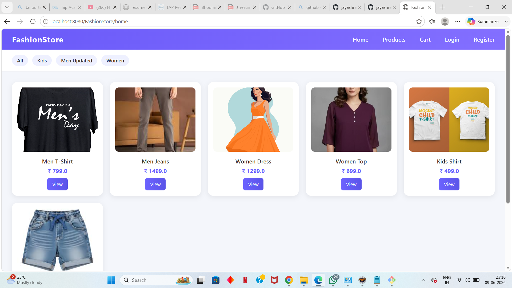
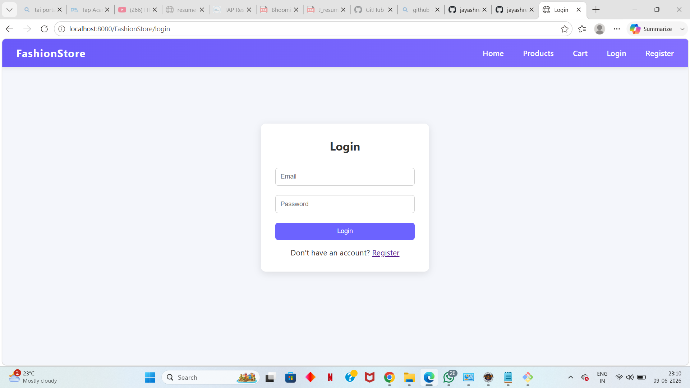
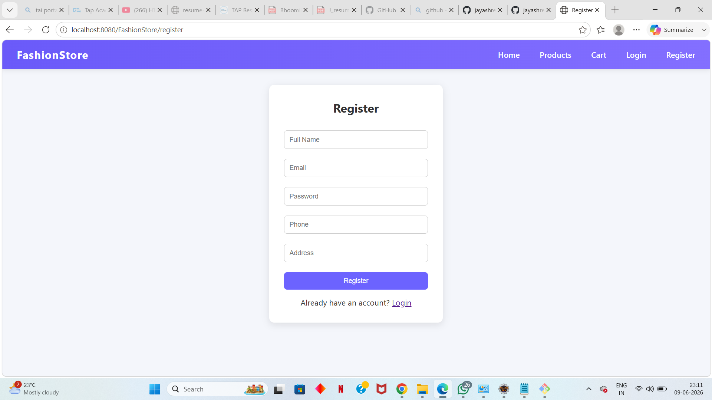
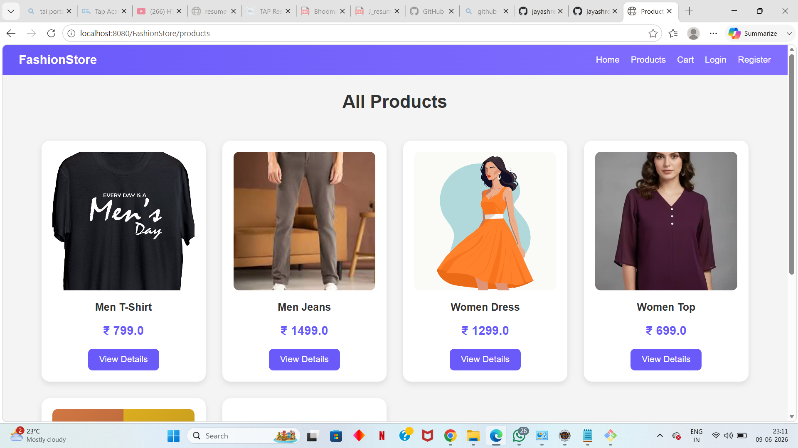
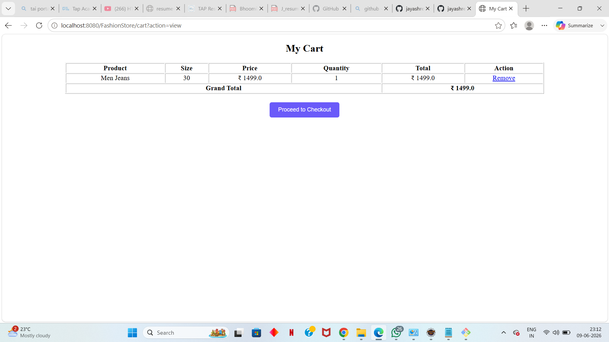

# FashionStore – E-Commerce Web Application

A Java-based E-Commerce Web Application developed using JSP, Servlets, JDBC, MySQL, HTML, and CSS.

## Features

* User Registration and Login
* Product Browsing
* Shopping Cart
* Order Placement
* MySQL Database Integration

Project developed by Jayashree Sheelvant.

## Screenshots

### Home Page

### Login Page

### Registration Page

### Product Page

### Shopping Cart

